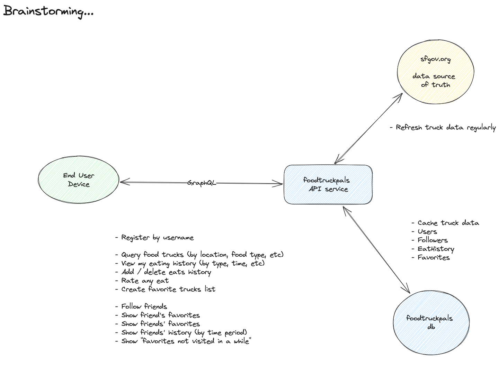

# FoodTruckPals

Elixir backend to support ....

## Ideation

See diagrams for overview of user stories and system architecture.

### Jobs to be Done by User

- Register by username
- Find food trucks by food type, location, etc.
- See history of my visits to food trucks.
- Add more visits to my history.
- Specify what I ate on a visit.
- Rate my eats.
- Indicate my favorite trucks.
- Follow other users (friends)
- See friends' favorites and history.
- See "favorites not recently visited" or "least visited".

### Architecture



- API backend
    - Serves requests from client
    - GraphQL based
- Food Truck database
    - Caches sfgov truck data
    - Contexts for:
        - Users (accounts)
        - Eating history
        - Favorite eats
        - Ratings
        - Followers
- sfgov data api
    - Grab latest sfgov data and sync into the Food Truck database.
    - Create process to handle this async on a regular basis.

## Developing w Docker

Spin up the containers using docker compose:
> docker compose up

If this is the first time starting the phoenix service, then you'll see
error output with info about running `mix deps.get` and `mix deps.compile`.
You should terminal into the docker container and run these commands:

```
> docker compose api /bin/bash
> mix deps.get
> mix deps.compile
> exit
```

Afterwards, please be sure to restart the docker compose containers:

> docker compose restart

Then visit [`localhost:4000`](http://localhost:4000) from your browser.

Start a terminal in the elixir container (to run tests, for example):
> docker compose exec api /bin/bash
> mix test

Spin down the containers using docker compose:
> docker compose down

## ToDos

- Create db tables:
    - food truck data cache (mirror sfgov)
    - user and other tables

- Create daily task to sync data from sfgov to local db
