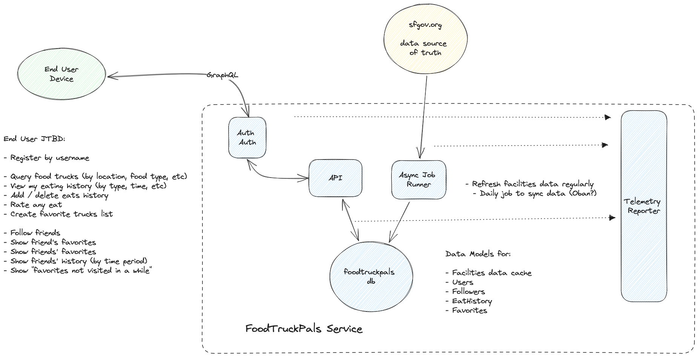

# FoodTruckPals
See instructions at: [https://github.com/peck/engineering-assessment](https://github.com/peck/engineering-assessment)

Elixir backend API service to help users to:
- Find food trucks
- Track their history of food truck visits
- Save favorite trucks and rate food items
- Follow other users
- Get insights into recommended next visits
- Etc...

## Ideation

### Jobs to be Done by User

- Register by username
- Find food trucks by food type, location, etc.
- See history of my visits to food trucks.
- Add more visits to my history.
- Specify what I ate on a visit.
- Rate my eats.
- Indicate my favorite trucks.
- Follow other users (friends)
- See friends' favorites and history.
- See "favorites not recently visited" or "least visited".

## Architectural Overview



This service will have the following major components:
1. **Database**
    - Data models for:
        - Food truck facilities
            > A cache for the sfgov data. The source of truth will remain the SF Gov site. Will likely only use a sub-set of columns available.
        - User accounts
            > Phone number or email will be used as unique identifiers.
        - Followers
            > Will be used to filter favorites, history, rating, etc. Also utilized for notifications.
        - Eating history
        - Favorites
            > Support management of favorite facilities by users.
        - Ratings
            > Score ratings for food items.
2. **API backend**
    > Phoenix server using Absinthe graphQL library.
3. Authenication / Authorization
    > Implement basic auth/auth for now, but keep flexible for other auth methods such as OAuth.
4. **Async Job Runner**
    > Grab latest sfgov data and sync into the Food Truck database. Run this on a regular basis and be sure to build in defensive programming measures.
5. **Telemetry and Metrics**

## Development Plan

1. **Populate food facility data**
    - [x] create facilities data cache (mirror sfgov)
    - [x] create module to grab data from sfgov
    - [ ] create function to bulk update facilities cache data
    - [ ] create ansyc job to update cache daily (use Oban?)
2. **User registration**
    - [ ] create user data model
    - graphQL handlers to:
        - [ ] create a user
        - [ ] confirm a user
        - [ ] list, update and delete user (needs auth)
3. **Search facilities**
    - graphQL queries to:
        - [ ] find by name, type, other attributes...
        - [ ] find new
        - [ ] find by location?
4. **Manage history and favorites**
    - create data models:
        - [ ] facility_visits (history)
        - [ ] favorite_facilities
        - [ ] facility_ratings
    - graphQL mutations to:
        - [ ] record a visit
        - [ ] delete a visit
        - [ ] save and unsave favorite facilities
        - [ ] list favorites
        - [ ] rate a facility
5. **Manage followers**
    - [ ] create user_followers data model
    - graphQL query to:
        - [ ] list followers for a given user
        - [ ] list users followed by a given user
6. **Recommendations**
    - graphQL queries to:
        - [ ] show favorite facilities not visited recently
        > Technical note: be sure to make queries easily composable that that complex queries can be easily made.

## Instructions for Developing with Docker

Spin up the containers using docker compose:
> docker compose up

If this is the first time starting the phoenix service, then you'll see
error output with info about running `mix deps.get` and `mix deps.compile`.
You should terminal into the docker container and run these commands:

```
> docker compose api /bin/bash
> mix deps.get
> mix deps.compile
> exit
```

Afterwards, please be sure to restart the docker compose containers:

> docker compose restart

Then visit [`localhost:4000`](http://localhost:4000) from your browser.

Start a terminal in the elixir container (to run tests, for example):
> docker compose exec api /bin/bash
> mix test

Spin down the containers using docker compose:
> docker compose down
